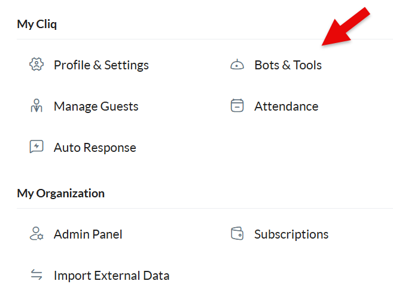
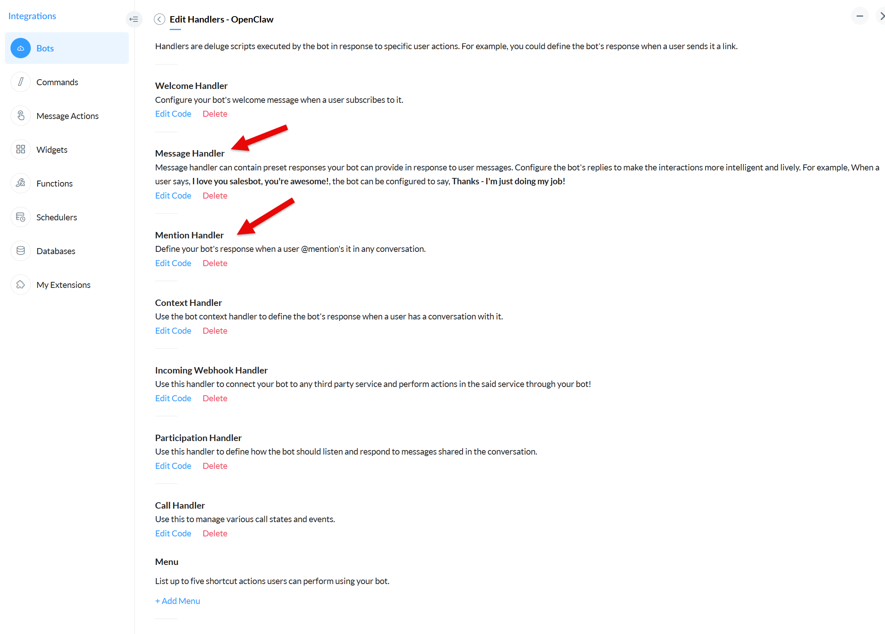

<p align="center">
  
</p>

<h1 align="center">Zoho Cliq Channel for OpenClaw</h1>

<p align="center">
  Connect your OpenClaw agent to <a href="https://www.zoho.com/cliq/"><b>Zoho Cliq</b></a> —
  reply to DMs and channel @mentions as a native bot, with streaming previews,
  cards, buttons, and message actions.
</p>

<p align="center">
  <code>openclaw plugins install clawhub:@sprintcx/openclaw-cliq</code>
</p>

<p align="center">
  <b>Channel plugin</b> · OAuth 2.0 · multi-data-center · MIT · verified live on a real gateway
</p>

---

## ⚡ Quick start

Get a bot answering **DMs** in four steps (channel @mention replies add one OAuth step — see [Setup guide](#setup-guide) below):

1. **Create a Cliq bot** — Zoho Cliq → *Bots* → *Create Bot*. Note the **Bot Unique Name** (`botId`) and display name.
2. **Get OAuth credentials** — [Zoho API Console](https://api-console.zoho.com) ([use your data center's domain](#data-centers)) → *Self Client* → note **Client ID** + **Client Secret**.
3. **Install & configure**
   ```bash
   openclaw plugins install clawhub:@sprintcx/openclaw-cliq
   openclaw setup            # pick "Zoho Cliq" — the wizard writes the account config
   ```
4. **Wire the webhook** — paste the [Deluge handler](#5-deluge-webhook-handler) into the bot's Message/Mention handlers, pointing at `https://<your-gateway>/cliq/webhook`.

DM the bot → it answers. To also reply to channel **@mentions** and stream live edits, add the one-time refresh token in [§3c](#3c-obtain-the-user-context-refresh-token-required-for-channel-posts--edits).

> **Verified live.** DMs and channel @mentions both round-trip end to end on a real OpenClaw gateway.

---

## Features

| | Capability |
| --- | --- |
| 💬 **Messaging** | DMs + channel @mentions, inbound via a Deluge webhook, outbound as the bot (DMs via `userids`, channel posts via `channelsbyname`). Inbound image / file / voice attachments are downloaded and handed to the agent. Send `stop` / `/stop` / `esc` to interrupt a running turn. **Cliq Form submissions** (structured input via the bot's Form Handler) are recognized and routed to the agent with their field values surfaced as `FormValues` / `FormName`. |
| ✍️ **Rich replies** | Markdown → Cliq formatting, **live-edit streaming previews**, interactive buttons & cards, slash-style commands, reply threading. **v3 Message Cards** (`apiVersion: "v3"`): `modern-inline` / `prompt` / `poll` themes, supporting-content **`slides`** (table / list / label / images / text blocks attached alongside the card), and `modern-inline` **`sections`** (in-card labeled field groups) + **`thumbnail`** header image. |
| ⚡ **Message actions** | Edit / delete / react to sent messages from the agent. |
| 🔐 **OAuth 2.0** | `client_credentials` for DMs; a user-context **refresh token** for channel posts / message edits. Works on any Zoho [data center](#data-centers). |
| 🛡️ **DM security** | `allowlist` / `pairing` / `open` / `disabled` policies with an approval flow. |
| 🧩 **Per-channel policy** | Group admission + per-channel `requireMention`, tool policy, and per-sender tool overrides. |
| 🔁 **Reliability** | Durable-before-ack ingest, de-dup on redelivery, bot-loop / self-message protection, outbound retry with error classification (parses the v3 `{"message":"…"}` error envelope). |
| 🔒 **Hardened webhook** | Constant-time secret compare, single-header auth, failed-auth rate limiting. |
| 🩺 **Operations** | `openclaw status` / `channels` health probe, `openclaw directory` lookup, plugin doctor, interactive setup wizard, SecretRef credentials, security audit, session binding, multi-account, lifecycle hooks. |

> **Known limitation:** the bot can *send* reactions, but *inbound* reaction notifications (being told when a user reacts) are not yet possible — the OpenClaw plugin SDK exposes no inbound non-message event hook for external channel plugins. Tracked upstream: [openclaw/openclaw#100447](https://github.com/openclaw/openclaw/issues/100447).

---

## Setup guide

Everything that must be configured **on the Zoho side** so the `cliq` channel plugin can talk to your OpenClaw gateway.

> **📍 Pick your Zoho data center first.** Zoho stores each account in one region, and the domain differs per region. **The URLs below use `.com` (US) — replace `.com` with your data center's domain** (`.eu`, `.in`, `.com.au`, `.jp`, `zohocloud.ca`, `.sa`, `.com.cn`). The plugin's OAuth + API calls **default to the EU** endpoints; if your account is **not** on EU, also set `oauthBase` and `apiBase` in the config (see [§4](#4-openclaw-configuration)). Not sure which region you're on? Check the domain you log into Zoho at — e.g. `cliq.zoho.eu` → EU. Full mapping: [**Data centers**](#data-centers).

### Prerequisites

- A Zoho account with access to **Zoho Cliq** and the **Zoho API Console**.
- A running OpenClaw gateway reachable from the public internet (so Zoho can call the webhook). A reverse proxy, Cloudflare Tunnel, or `ngrok` all work for development.
- The bot owner must be able to create a bot in Cliq (admin / developer permission).

### 1. Create a Zoho Cliq Bot

Open the bot builder: click your **profile picture** (top-right in Zoho Cliq) → under **My Cliq** choose **Bots & Tools**.

<p align="center">
  
</p>

1. In **Bots & Tools**, open the **Bots** section.
2. Click **Create Bot**.
3. Fill in:
   - **Bot Name** (display name, e.g. `OpenClaw Agent`) — this is what users see.
   - **Bot Unique Name** (e.g. `openclaw_agent`) — this is the `botId` you will put in the plugin config. Lowercase, underscores, no spaces.
   - **Bot Type**: choose **Custom Bot** (a Deluge-backed bot whose handlers forward to the webhook). A pure "Webhook Bot" is not required — we use a Custom Bot with a Deluge handler that `invokeUrl`s our endpoint.
4. Set the bot's **Functional Handlers**:
   - **Mention Handler** — fired when the bot is @mentioned in a channel.
   - **Message Handler** — fired when a user DMs the bot directly.
5. **Publish / Activate** the bot (it must be active to receive events).
6. **Invite the bot into the channel(s)** where it should respond to mentions. In a Cliq channel: ⋯ → **Bots** → add your bot. The bot can always receive DMs without an explicit invite.

> The **Bot Unique Name** you pick here is the `botId` config field. The display name is `botName` (used for @mention stripping in the agent-visible text).

### 2. Configure the Webhook

The plugin registers a single HTTP route at **`POST /cliq/webhook`** on your OpenClaw gateway. Zoho Cliq's Deluge bot handler must POST every mention / message event to that URL.

1. Pick a strong random secret (e.g. `openssl rand -hex 32`) — this becomes your **`webhookSecret`**.
2. Note the public URL of your OpenClaw gateway, e.g. `https://openclaw.example.com`. The full webhook URL is:

   ```
   https://<gateway-host>/cliq/webhook
   ```

   The route is registered with `auth: "plugin"`, so no additional gateway-level bearer token is required; the `webhookSecret` is verified by the plugin itself via the `x-cliq-webhook-secret` header.

3. Make sure the gateway host is reachable from the public internet (Zoho's servers POST to it). For local development use a Cloudflare Tunnel / `ngrok` / reverse proxy.

4. In the Cliq Bot's Deluge editor (see step 5 below), set the webhook URL and the secret header on every `invokeUrl` call.

### 3. OAuth / API Credentials

The plugin uses **two** OAuth grant types, because the **`client_credentials`** grant CANNOT obtain a usable token for the `ZohoCliq.Channels.UPDATE` or `ZohoCliq.Messages.UPDATE` scopes — Zoho issues a token whose response *reports* the scope, but the API rejects it on use with `{"code":"oauthtoken_scope_invalid"}`. So:

- **Bot DMs** (`/bots/{botId}/message`, scope `ZohoCliq.Webhooks.CREATE`) → `client_credentials` (the plugin fetches a fresh access token automatically when the cached one expires; no refresh token, no user interaction).
- **Channel posts** (`/channelsbyname/{unique_name}/message`, scope `ZohoCliq.Channels.UPDATE`) and **message edits** (`/chats/{chatId}/messages/{messageId}`, scope `ZohoCliq.Messages.UPDATE`) → a **user-context refresh token** obtained once via the self-client `authorization_code` flow. The plugin mints short-lived access tokens from it via `grant_type=refresh_token` and caches them until they expire (~1h). Without a refresh token, channel replies and live-edit streaming previews will fail with `oauthtoken_scope_invalid` — DM-only setups keep working.

#### 3a. Create the OAuth client

1. Open the **[Zoho API Console](https://api-console.zoho.com)** — use **your** data center's domain ([Data centers](#data-centers)). Choose **Self Client** if you do not already have one for Cliq.
2. Create a **Server-based Application** (or Self Client) and note:
   - **Client ID**
   - **Client Secret**
3. Your data center's OAuth token endpoint (example uses US `.com`):

   ```
   https://accounts.zoho.com/oauth/v2/token
   ```

   The plugin **defaults to the EU** endpoint (`https://accounts.zoho.eu`). If your account is on another data center, set `oauthBase` (and `apiBase`) in the config ([§4](#4-openclaw-configuration)) to match — see [Data centers](#data-centers).

4. Copy **Client ID** and **Client Secret** — they go into `clientId` / `clientSecret` in the plugin config below.

#### 3b. Consent the scopes

When registering / re-consenting the self-client, request **all nine** scopes so both the `client_credentials` (DM) and refresh-token (channel/edit/delete/card) paths work:

| Scope | Grant | Purpose |
| --- | --- | --- |
| `ZohoCliq.Webhooks.CREATE` | `client_credentials` | Post bot DMs (the `/bots/{botId}/message` send path) |
| `ZohoCliq.Channels.UPDATE` | refresh token | Post bot messages to channels (the `/channelsbyname/{unique_name}/message` send path) |
| `ZohoCliq.Channels.CREATE` | refresh token | Post a v3 Message Card to a channel (only used when `apiVersion: "v3"` — the v2 channel card path reuses `Channels.UPDATE`; opt-in, see [§4](#4-openclaw-configuration)) |
| `ZohoCliq.Channels.READ` | `client_credentials` | Read channel / chat metadata |
| `ZohoCliq.Users.READ` | `client_credentials` | Resolve sender user info |
| `ZohoCliq.Messages.UPDATE` | refresh token | Edit a sent message in place (live-edit streaming previews) |
| `ZohoCliq.Messages.DELETE` | refresh token | Delete a sent message via the v3 bulk-delete endpoint (only used when `apiVersion: "v3"` — the v2 single-message delete reuses `Messages.UPDATE`; opt-in, see [§4](#4-openclaw-configuration)) |
| `ZohoCliq.messageactions.CREATE` | refresh token | Add / remove message reactions (the `message(action=react)` tool) |
| `ZohoCliq.Attachments.READ` | refresh token | Download inbound file / image / voice attachments (`GET /api/v2/files/{id}`) so they reach the agent |

> If you previously consented with only the original three scopes, you must re-consent (generate a fresh self-client token) with `ZohoCliq.Channels.UPDATE` and `ZohoCliq.Messages.UPDATE` added — channel replies will be rejected with `invalid_scope` / 401 until you do. `ZohoCliq.Messages.DELETE` and `ZohoCliq.Channels.CREATE` are only needed when you opt into `apiVersion: "v3"` (the v3 delete / v3 Message Card paths); the v2 paths reuse `Messages.UPDATE` / `Channels.UPDATE` respectively, so if you stay on the `"v2"` default you can skip them. Reactions (`ZohoCliq.messageactions.CREATE`) are optional — skip the scope if you don't need the `react` action, and the plugin will simply not advertise reaction support. Likewise `ZohoCliq.Attachments.READ` is only needed for **inbound media** (downloading images / files / voice a user sends) — skip it for a text-only bot and the plugin degrades to "no media" for those messages.

#### 3c. Obtain the user-context refresh token (required for channel posts + edits)

Channel posts need a **user-context** token, which `client_credentials` cannot provide
(Zoho issues a `client_credentials` token that *claims* the `ZohoCliq.Channels.UPDATE`
scope, but the channel API rejects it with `oauthtoken_scope_invalid`). You get a
user-context token from a **refresh token**, obtained once via the Self Client's
authorization-code flow. This is a **two-step** process — a short-lived **code** that you
exchange for a permanent **refresh token**.

> **v3 opt-in can skip this for channel *text* posts and bot *DM* posts.** Setting
> `apiVersion: "v3"` (see [§4](#4-openclaw-configuration)) routes channel **text**
> posts through `POST /api/v3/channelsbyname/{name}/messages` **and** bot **DM**
> posts through `POST /api/v3/bots/{botId}/messages` — both of which use the
> `ZohoCliq.Webhooks.CREATE` scope obtainable via `client_credentials`, so a
> refresh token is **not** required for either. The v3 DM endpoint posts *as the
> bot* (sender identity preserved — the bot unique name is in the URL path) and
> uses `user_ids` + `sync_message` so the response carries the message id + chat
> id for live-edit. The v3 path also routes the message **delete** family through
> the v3 bulk-delete endpoint `DELETE /api/v3/chats/{chatId}/messagess?message_ids=<id>`
> (a 1-element delete-multiple call) with the `ZohoCliq.Messages.DELETE` scope —
> that scope still needs a user-context refresh token (same constraint as
> `Messages.UPDATE`), so the refresh token is still required for deletes even in
> v3 mode. Channel card/button posts (in channels), media posts, and message
> edits still require the refresh token (channel card posts route through the
> v3 Message Card endpoint `POST /api/v3/channels/{name}/message` with the
> `ZohoCliq.Channels.CREATE` scope — a user-context scope, same constraint
> as `Channels.UPDATE`; media posts stay on v2 indefinitely — v3 has no
> byte-upload surface, only a public-HTTPS-image Message-Card slide that
> posts as the user, not the bot; message edits stay on v2 indefinitely —
> v3 Messages has no single-message edit endpoint). **DM
> card/button posts** in v3 mode route through the v3 "Send a bot message"
> endpoint `POST /api/v3/bots/{botId}/messages` with a top-level `card` field
> — the same `Webhooks.CREATE` scope as DM text posts (`client_credentials`,
> **no refresh token needed**), posting *as the bot* and addressing the
> recipient via `user_ids` (no chat-id resolution needed). The
> default is `"v2"` (no behavior change). If you only need channel text posts,
> DM text posts, and DM cards and never edits/cards-in-channels/deletes,
> `apiVersion: "v3"` lets you skip this
> step entirely (deletes also work in v3 mode once the refresh token is set, but
> skip `Messages.DELETE` from the scope if you don't use deletes; likewise skip
> `Channels.CREATE` if you don't use v3 channel cards). Verify your Zoho org accepts the v3 endpoints before relying on it.

> **Why only once:** only the *code* is short-lived (10 minutes, single-use). The
> **refresh token you get from it does not expire** — it survives gateway restarts and any
> amount of downtime. You do this once per Cliq org and never again (unless you revoke it).

**Step 1 — generate the code (valid 10 minutes):**

1. In the **[Zoho API Console](https://api-console.zoho.com)** ([your data center](#data-centers)) → your **Self Client** → tab **Generate Code**.
2. **Scope** (the Self Client field is comma-separated, no spaces):
   ```
   ZohoCliq.Webhooks.CREATE,ZohoCliq.Channels.UPDATE,ZohoCliq.Channels.CREATE,ZohoCliq.Messages.UPDATE,ZohoCliq.Messages.DELETE,ZohoCliq.Channels.READ,ZohoCliq.Users.READ,ZohoCliq.messageactions.CREATE,ZohoCliq.Attachments.READ
   ```
3. **Time Duration:** 10 minutes. **Scope Description:** anything (e.g. `openclaw`). Pick your **portal/org** if prompted.
4. Click **Create** and copy the code — it looks like `1000.<hex>.<hex>`.

**Step 2 — exchange the code for a refresh token (do this within the 10 minutes):**

The Self Client console gives you a *code*, not the token. Exchange it against **your data
center's** token endpoint (the example uses US `.com` — see [Data centers](#data-centers);
no `redirect_uri` is needed for the self-client flow):

```bash
curl -X POST "https://accounts.zoho.com/oauth/v2/token" \
  -d "grant_type=authorization_code" \
  -d "client_id=<clientId>" \
  -d "client_secret=<clientSecret>" \
  -d "code=<code from step 1>"
```

The response is JSON:

```json
{
  "access_token": "1000....",     // short-lived (~1h) — ignore it
  "refresh_token": "1000....",    // PERMANENT — this is the one you keep
  "scope": "ZohoCliq.Webhooks.CREATE ZohoCliq.Channels.UPDATE ...",
  "expires_in": 3600
}
```

Copy the **`refresh_token`** value.

**Step 3 — store it:** put the `refresh_token` in the plugin config as `refreshToken` (see §4).
From then on the plugin mints its own short-lived access tokens from it automatically
(`grant_type=refresh_token`), forever.

> **Troubleshooting:**
> - `invalid_code` on exchange → the code expired (>10 min) or was already used once. Generate a fresh one.
> - Channel replies still `oauthtoken_scope_invalid` → the `refreshToken` is missing from config, or was minted without `ZohoCliq.Channels.UPDATE`. Re-run 3c with the full scope list.
> - `channel_not_exists` on a real channel → the bot is not a **participant** of that channel (invite it: channel ⋯ → **Bots**), or you used the channel's *display name* instead of its **unique name** (the technical name — e.g. a channel shown as "Finance" may have the unique name `invest`).

If you skip 3c entirely, the plugin still works for **bot DMs** (the `client_credentials`
path); only channel @mention replies and live-edit message edits require the refresh token.

### 4. OpenClaw Configuration

Add the `cliq` channel to your `openclaw.json` (or via `openclaw setup` / the setup wizard's `applyAccountConfig` step). The required fields are `clientId`, `clientSecret`, and `botId`; `botName`, `webhookSecret`, and `allowFrom` are recommended.

```jsonc
{
  "channels": {
    "cliq": {
      "accounts": {
        "default": {
          "clientId": "<OAuth client id from step 3a>",
          "clientSecret": "<OAuth client secret from step 3a>",
          "botId": "openclaw_agent",      // Bot Unique Name from step 1
          "botName": "OpenClaw Agent",    // Bot display name from step 1
          "webhookSecret": "<secret from step 2>",
          "refreshToken": "<refresh token from step 3c — required for channel posts / edits>",
          "allowFrom": ["<zoho user id of each allowed DM sender>"],
          "dmPolicy": "allowlist",        // "open" | "allowlist" | "pairing" | "disabled"
          // Data center: omit both for EU (default). For any other region set both
          // to your data center's endpoints — see "Data centers" below.
          "oauthBase": "https://accounts.zoho.com",
          "apiBase": "https://cliq.zoho.com"
        }
      }
    }
  }
}
```

| Field | Required | Description |
| --- | --- | --- |
| `clientId` | yes | OAuth client id from the Zoho API Console. |
| `clientSecret` | yes | OAuth client secret (sensitive). |
| `botId` | yes | Bot **Unique Name** (the path segment in the bot message API). |
| `botName` | recommended | Bot display name. Used to strip the `@botName` mention from the text the agent sees. |
| `webhookSecret` | recommended | Shared secret the Deluge handler sends in the `x-cliq-webhook-secret` header. If unset, the webhook accepts all requests (not recommended). |
| `refreshToken` | recommended | User-context OAuth refresh token (sensitive). Obtained once via the self-client `authorization_code` flow (§3c). **Required for channel @mention replies and live-edit message edits** — without it, those paths fail with `oauthtoken_scope_invalid` (the `client_credentials` grant cannot obtain a usable token for `ZohoCliq.Channels.UPDATE` / `ZohoCliq.Messages.UPDATE`). DM-only setups can leave it unset. |
| `allowFrom` | optional | Array of Zoho Cliq user ids allowed to DM the bot (only effective when `dmPolicy` is `allowlist` or `pairing`). |
| `dmPolicy` | optional | DM admission policy. Default is `allowlist` (deny by default). `pairing` starts the OpenClaw pairing approval flow for unknown senders. Accepted values: `open`, `allowlist`, `pairing`, `disabled` (schema-validated — unknown field names like `dmSecurity` are rejected). |
| `groupPolicy` | optional | Group/channel admission policy. `open` lets the bot respond in any channel it's @mentioned in; `allowlist` (the effective default once a `groups` map is present) restricts it to channels listed under `groups`; `disabled` ignores all group messages. |
| `groups` | optional | Per-channel config keyed by the Cliq **channel unique name**. Each entry supports `requireMention` (boolean — `false` lets the bot respond in that channel without an explicit @mention), `ingest` (boolean), `tools` (`{ allow, alsoAllow, deny }` tool policy for that channel), and `toolsBySender` (per-sender tool policy overrides keyed by `channel:cliq:<senderId>`, `id:<senderId>`, `name:<display>`, `e164:<phone>`, `username:<handle>`, or `*`). A `*` entry applies to any channel not listed explicitly. |
| `thinking` | optional | Instant acknowledgement / "thinking" placeholder. `thinking.mode` selects the acknowledgement style: `"off"` (default — no extra API call per turn), `"placeholder"` (post a lightweight text placeholder, default `💭 …`, configurable via `thinking.text`, then edit it in place into the final reply — exactly one message, no duplicate), or `"card"` (post a v3 Message Card status indicator — a `modern-inline` card — instead of plain text, and transition its title through explicit phases as the turn runs: it is first posted with the "thinking" phase title `thinking.thinkingText`, default `💭 thinking…`, then edited in place to the "generating" phase title `thinking.text`, default `Generating…`, right before the agent turn dispatches, and finally edited into the reply text when the reply arrives). On `apiVersion: "v3"` the card is a real card posted via the v3 Message Card endpoints (DM via `POST /api/v3/bots/{botId}/messages` with scope `Webhooks.CREATE`, channel via `POST /api/v3/channels/{name}/message` with scope `Channels.CREATE`); on v2 it degrades to the plain-text placeholder since v2 has no buttonless card. This is the Cliq-appropriate substitute for a typing indicator (Cliq exposes no bot typing API). Any acknowledgement mode is a no-op when `streaming.preview` is `"on"` (the live-edit path already shows progress) or no `refreshToken` is configured (editing the placeholder into the reply needs the user-context token). `thinking.failureText` (optional) overrides what the placeholder/card becomes when the agent turn ends with **no reply** (the turn threw, or the model produced no output): when set, the placeholder is edited into that text (e.g. `⚠️ No reply generated.`); when unset, the untouched placeholder is **deleted** so no stray indicator lingers. **Confirmation gate** (card-mode only): set `thinking.confirm` to gate sensitive inbound actions behind an explicit Confirm / Cancel button card instead of dispatching immediately. `"off"` (default) disables gating; `"sensitive"` gates only when the cleaned message matches a `thinking.confirmKeywords` entry (case-insensitive word-boundary match; defaults to a conservative destructive-verb list — `delete`, `drop`, `reset`, `wipe`, `purge`, …); `"always"` gates every turn (apart from abort intents and Confirm-button re-dispatches). When gated, a `prompt`-theme Message Card titled `thinking.confirmText` (default `⚠️ Confirm action?`) with `thinking.confirmLabel` / `thinking.cancelLabel` buttons (defaults `Confirm` / `Cancel`) is posted and the agent turn is held until the user taps a button. **Confirm** re-posts the original message (prefixed with a sentinel) so the next webhook call dispatches the agent with the gate skipped (no re-prompt loop); **Cancel** posts a sentinel that short-circuits the turn with `thinking.cancelledText` (default `🚫 Cancelled.`) and no agent dispatch. The button clicks arrive as ordinary inbound messages via the bot's Message handler (`invoke.bot`) — no Cliq Context handler is required. Messages longer than 1500 chars bypass the gate (cannot be safely encoded in the confirm button payload). The gate is a UX guardrail, not a security boundary — the agent's own tool / permission policy still applies to the confirmed action. No new OAuth scope (reuses the card-path scopes). |
| `welcome` | optional | Welcome message on subscribe. When the Cliq bot **Welcome Handler** forwards a subscribe event to the webhook (see [§5a](#5a-welcome-handler-optional)) and `welcome.enabled === true`, the bot posts a configurable greeting DM to the subscriber. `welcome.text` is used for first-time subscribers and `welcome.textRejoin` for users who unsubscribed and came back; both default to a friendly greeting and support `{{firstName}}` / `{{lastName}}` / `{{name}}` / `{{id}}` / `{{email}}` placeholders resolved from the forwarded `user` object. The DM admission policy (`dmPolicy` / `allowFrom`) is honored — a denied sender is never greeted, and under the `pairing` policy an un-paired subscriber is skipped (the pairing flow owns their first contact). Default `enabled: false` (opt-in, so no setup gets a surprise greeting). A redelivered subscribe event is deduped so the user is never greeted twice. |
| `oauthBase` | optional | OAuth base URL for your Zoho **data center**. Defaults to the EU endpoint `https://accounts.zoho.eu`. Set it (together with `apiBase`) when your account is not on EU — see [Data centers](#data-centers). |
| `apiBase` | optional | Cliq REST API base URL for your Zoho **data center**. Defaults to the EU endpoint `https://cliq.zoho.eu`. Set it (together with `oauthBase`) when your account is not on EU. |
| `apiVersion` | optional | REST API generation for the channel **text** post, bot **DM** post, message **delete**, and channel **card/button** post families. `"v2"` (default) uses the verified-live v2 endpoints (channel posts require `refreshToken` + `ZohoCliq.Channels.UPDATE`; DMs use `ZohoCliq.Webhooks.CREATE` via `client_credentials`; deletes use `ZohoCliq.Messages.UPDATE` via the refresh-token grant; channel cards use `Channels.UPDATE` with bot sender identity). `"v3"` opts channel text posts into `POST /api/v3/channelsbyname/{name}/messages`, bot DMs into `POST /api/v3/bots/{botId}/messages` — both of which use the `ZohoCliq.Webhooks.CREATE` scope (obtainable via `client_credentials`, so **no refresh token needed** for either — see [§3c](#3c-obtain-the-user-context-refresh-token-required-for-channel-posts--edits)) — AND deletes into the v3 bulk-delete endpoint `DELETE /api/v3/chats/{chatId}/messagess?message_ids=<id>` (a 1-element delete-multiple call) which uses the `ZohoCliq.Messages.DELETE` scope (user-context, refresh-token grant — so deletes still need `refreshToken` even in v3 mode) AND channel card/button posts into the v3 Message Card endpoint `POST /api/v3/channels/{name}/message` (note: `channels`, not `channelsbyname`, singular `message`) which uses the `ZohoCliq.Channels.CREATE` scope (user-context, refresh-token grant) and a v3 Message Card body whose `theme` is selected by the card sender (`modern-inline` for agent-emitted presentations and the `message(action=send, buttons=[...])` tool — header + optional text slide + action buttons; the `message(action=send, slides=[...])` tool attaches structured `table` / `list` / `label` / `images` / `text` supporting-content blocks via the theme-independent top-level `slides` array; the `message(action=send, thumbnail="https://…", sections=[{ title?, fields: [{ title, value }] }])` tool attaches a `modern-inline`-only header `thumbnail` image (HTTPS URL) and in-card labeled field `sections` (both ignored for `prompt` / `poll`); `prompt` for the slash-command quick-reply buttons emitted by the `/models` and `/model` menus — a focused quick-reply card with a title + 1–5 action buttons, no sections; `poll` for voting cards emitted by the `message(action=send, theme="poll", pollOptions=[...])` tool — a title + 2–10 plain-text options, no buttons; Cliq counts votes natively, so a poll does NOT post anything back to the bot). The v3 Message Card docs do not document a `bot_unique_name` query param, so a v3 channel card posts **as the authenticated user** (the OAuth client owner), not as the bot — a behavior difference from the v2 channel card path; users who need bot sender identity for cards stay on `"v2"`. DM card/button posts in v3 mode route through the v3 "Send a bot message" endpoint `POST /api/v3/bots/{botId}/messages` with a top-level `card` field — the same `Webhooks.CREATE` scope as DM text posts (`client_credentials`, **no refresh token needed**), posting *as the bot* (sender identity preserved) and addressing the recipient via `user_ids` (no chat-id resolution needed); the `poll` theme works for DM cards too (the v3 bot-message endpoint accepts a `card` object directly). The v3 DM endpoint posts *as the bot* (sender identity preserved) and uses `user_ids` + `sync_message` so the response carries the message id + chat id for live-edit. The v3 delete response is a per-message `message.delete_result` list parsed into a boolean. Other families (media, edits, list, reactions, directory) stay on v2 regardless — v3 Messages has no single-message edit or get endpoint (only delete-multiple, post, forward, search), so edit/list stay v2 indefinitely. v3 channel posts return no message id (live-edit for channel posts degrades to block-streaming); v3 DMs with `sync_message: true` DO return the message id. Per-account overrides supported (one account can pilot v3 while others stay on v2). |

**Group/channel identity:** the inbound path sets the OpenClaw `From` context field to `cliq:group:<channelUniqueName>` for group messages (and fills `GroupChannel`/`GroupSubject` with the display name as a fallback), so the `groups` adapter resolves per-channel `requireMention` and tool policy by channel unique name. Keys are matched case-insensitively.

**Gateway reachability:** the host running the OpenClaw gateway must be reachable from the public internet at `https://<gateway-host>/cliq/webhook`. If you run the gateway behind a reverse proxy / Cloudflare Tunnel, make sure TLS termination and the `Host` header are preserved.

### 5. Deluge Webhook Handler

The Cliq bot must forward every mention / message event to the OpenClaw webhook. Paste this Deluge script into the bot's **Mention Handler** and **Message Handler** functions in the Cliq Bot editor.

> **Where to find them:** in the Cliq Bot editor open **Edit Handlers**, then click *Edit Code* on **Message Handler** (DMs) and **Mention Handler** (channel @mentions) — the two arrowed below.

<p align="center">
  
</p>

```deluge
// === Configuration (set these once) ===
// Public URL of your gateway's /cliq/webhook route. If you expose the gateway
// port directly (no reverse proxy / TLS) this is http://<host>:18789/cliq/webhook.
webhookUrl    = "https://<gateway-host>/cliq/webhook";
webhookSecret = "<the same secret you set as webhookSecret in openclaw.json>";

// Cliq provides `message`, `user`, and `chat` in the Message/Mention handler
// scope. The plugin's parser accepts these Cliq objects as-is (it tolerates the
// different chat/channel key variants), so just forward them directly.
payload = Map();
payload.put("handler", "message");   // <-- use "mention" in the Mention Handler
payload.put("message", message);
payload.put("user", user);
payload.put("chat", chat);

// Auth + content type. The secret header is REQUIRED when webhookSecret is set
// in openclaw.json; Content-Type MUST be application/json.
headers = Map();
headers.put("Content-Type", "application/json");
headers.put("x-cliq-webhook-secret", webhookSecret);

// POST to OpenClaw as raw JSON. Use `body:` (NOT `parameters:`) — see note below.
invoke_response = invokeUrl
[
    url    : webhookUrl
    type   : POST
    body   : payload.toString()
    headers: headers
];

// The reply is delivered by the OpenClaw gateway via the Cliq bot API, so the
// handler itself returns an empty response.
response = Map();
return response;
```

> This is the same script for both handlers — the **only** difference is the
> `handler` value: `"message"` in the **Message Handler** (DMs) and `"mention"`
> in the **Mention Handler** (channel/group @mentions). Group vs DM is detected
> automatically from the forwarded `chat` object, so no extra mapping is needed.

> **Do not use `parameters: payload.toString()`.** In Deluge, `invokeUrl`'s
> `parameters:` key serializes the value as form-urlencoded data
> (`handler=mention&message=...`), which is **not** the JSON body this
> plugin expects — the gateway returns `400 Unexpected token 'h',
> "handler=me"... is not valid JSON`. Always use `body:` together with
> the `Content-Type: application/json` header shown above.

#### 5a. Welcome Handler (optional)

The Cliq bot **Welcome Handler** fires when a user subscribes (or re-subscribes) to the bot. To greet new subscribers from OpenClaw config rather than hard-coding the message in Deluge, paste this script into the bot's **Welcome Handler** function (in the Cliq Bot editor → **Edit Handlers** → *Edit Code* on **Welcome Handler**). It forwards the subscribe event to the same `/cliq/webhook` endpoint the Message/Mention handlers use, with `handler: "welcome"` and Cliq's `newuser` boolean:

```deluge
// === Configuration (set these once — same values as §5) ===
webhookUrl    = "https://<gateway-host>/cliq/webhook";
webhookSecret = "<the same secret you set as webhookSecret in openclaw.json>";

payload = Map();
payload.put("handler", "welcome");
payload.put("user", user);
payload.put("newuser", newuser);

headers = Map();
headers.put("Content-Type", "application/json");
headers.put("x-cliq-webhook-secret", webhookSecret);

invokeUrl
[
    url    : webhookUrl
    type   : POST
    body   : payload.toString()
    headers: headers
];

// The greeting is delivered by the OpenClaw gateway via the Cliq bot API,
// so the handler itself returns an empty response.
response = Map();
return response;
```

When `welcome.enabled === true` in the channel config, the gateway posts the configured greeting DM to the subscriber (see the `welcome` row in [§4](#4-openclaw-configuration)). The event is always acknowledged so Cliq does not redeliver it; a redelivery is deduped by subscriber id so the user is never greeted twice. The `dmPolicy` / `allowFrom` gate is honored — a denied sender is never greeted. Without this handler, or with `welcome.enabled === false` (the default), subscribe events are simply not consumed by the plugin.

#### 5b. Form Handler (optional — structured input)

Zoho Cliq's platform **Forms** let you define a structured form (text / number / dropdown / date / … fields) that a user fills out from the bot's command surface. When a user submits a form, the bot's **Form Handler** Deluge script fires and can forward the submitted values to the OpenClaw webhook so the agent receives them as structured input rather than free text — useful for approval / collection flows (pairing approval, parameter capture) instead of asking the user to type free-text answers.

Paste this script into the bot's **Form Handler** function (in the Cliq Bot editor → **Edit Handlers** → *Edit Code* on **Form Handler**) — it forwards to the same `/cliq/webhook` endpoint the other handlers use:

```deluge
// === Configuration (set these once — same values as §5) ===
webhookUrl    = "https://<gateway-host>/cliq/webhook";
webhookSecret = "<the same secret you set as webhookSecret in openclaw.json>";

// Cliq passes the submitted values to the Form Handler scope as the `form`
// object's fields (each named after your form field). Read them out and
// forward them as a `values` map the plugin can parse.
payload = Map();
payload.put("handler", "form");
payload.put("form", { "name": "approval_request" });   // your form's name
payload.put("user", user);
payload.put("chat", chat);

// Build the submitted-values map. Replace the keys with your own form's
// field names; Cliq passes each field value as a Deluge variable named after
// the field. Example fields: approver, priority, reason.
values = Map();
values.put("approver", approver);
values.put("priority", priority);
values.put("reason", reason);
payload.put("values", values);

headers = Map();
headers.put("Content-Type", "application/json");
headers.put("x-cliq-webhook-secret", webhookSecret);

invokeUrl
[
    url    : webhookUrl
    type   : POST
    body   : payload.toString()
    headers: headers
];

// The reply is delivered by the OpenClaw gateway via the Cliq bot API,
// so the handler itself returns an empty response.
response = Map();
return response;
```

When a form submission arrives, the plugin synthesizes the agent's message body from the submitted values:

```
Form: approval_request
approver: alice@corp.com
priority: High
reason: prod deploy gate
```

The raw structured values are ALSO surfaced on the inbound context as `FormValues` (a string-keyed map) and `FormName` (the form's display name), so an agent tool or downstream flow can read them as structured data rather than parsing the body text. A form submission is treated as a directed action at the bot — a group form submission is admitted without a separate @mention (the same way a reply to the bot is). DM admission (`dmPolicy` / `allowFrom`) and self-message / dedupe guards apply unchanged. A form submission whose every field is empty is dropped (no agent-readable content). No new OAuth scope is required — the Form Handler is a bot handler that posts to the webhook over the same `x-cliq-webhook-secret`-authenticated transport as Message / Mention / Welcome. There is no separate opt-in config field — if no form is wired up, no form submissions arrive.

#### Payload format reference

The plugin parses the JSON payload posted by the Deluge handler. The canonical shape is:

```jsonc
{
  "handler": "mention",            // "mention" | "message"
  "message": { "text": "hi", "id": "msg_123", "time": "2026-07-04T10:00:00Z" },
  "user":    { "id": "12345", "name": "Jane Doe", "email_id": "jane@example.com" },
  "chat":    { "id": "cl_abc", "type": "channel", "title": "Engineering" },
  "channel": { "id": "ch_1", "name": "engineering", "unique_name": "engineering" },
  "mentions": [ { "id": "openclaw_agent", "name": "OpenClaw Agent", "type": "bot" } ]
}
```

Notes (the parser is tolerant):

- `message` may be a plain string instead of `{ text, id, time }`.
- A wrapped `params` object (`{ params: { message, user, channel } }`) is also accepted.
- Group vs DM detection: `chat.type === "channel"` (or the presence of `channel.*` fields) marks a group; otherwise the message is treated as a DM.
- The `x-cliq-webhook-secret` header is checked against the configured `webhookSecret`. The plugin also accepts `x-webhook-secret` or `Authorization: Bearer <secret>` for convenience.
- **Form submissions** (see [§5b](#5b-form-handler-optional--structured-input)): a payload with `handler: "form"` and/or a non-empty `values` object (also accepted under `form.values` / `form_data` / `formvalues`, including inside a `params` wrapper) is recognized as a Cliq Form submission; the submitted field values synthesize the agent body and are surfaced as `FormValues` / `FormName` on the inbound context.

##### Inbound quote / reply context

When a user replies to or quotes a message in Cliq, the Deluge message handler receives the **new** message — Cliq does not automatically attach the quoted message's text to the bot. The plugin surfaces the referenced message to the agent from whatever the handler forwards:

- **`message.reply_to`** (string message id) — the documented Cliq shape. The plugin carries the parent message id into the inbound context.
- **`parent` / `quoted` / `parent_message` / `quoted_message` / `reply_to_message`** (object at the payload root, or under `message`) — the full parent message `{ id, text, sender: { id, name } }`. When the handler forwards this, the agent sees the quoted text + sender directly.

When only the parent **id** is present (the default `message.reply_to` shape) and a user-context `refreshToken` is configured, the plugin best-effort fetches the parent message text via `GET /api/v2/chats/{chatId}/messages` and prepends it to the agent envelope as:

```
↩ Replying to <senderName>:
> <quoted text>

<the user's message>
```

A failed or empty fetch degrades to "no quote text" and never breaks the turn.

A reply to the bot in a group is also admitted as an implicit mention (the `reply_to_bot` / `quoted_bot` gating kinds) — the user does not need to re-@mention the bot when replying to one of its messages.

> Forwarding the parent object is **optional**. Without it the plugin still carries the parent message id; it only cannot show the quoted text unless a `refreshToken` is configured (so the plugin can fetch it). If your Deluge handler can resolve the parent message (e.g. via the Cliq REST `GET /chats/{CHAT_ID}/messages/{MESSAGE_ID}` endpoint), add it under `parent` (or `quoted`) so the agent sees the quote even in DM-only setups with no `refreshToken`.

### Stop / abort the running turn

A user can interrupt a running agent turn by sending a **stop intent** — `stop`, `/stop`, `esc`, or a common localized equivalent (`halt`, `arrête`, `停止`, `стоп`, …). When the plugin recognizes the intent it marks the turn as an authorized command, and the OpenClaw runtime's fast-abort path cancels the in-flight run for that session (`cancelSession` + run-target abort), clears any queued follow-ups, stops spawned sub-agents, and replies with the canonical acknowledgement (`⚙️ Agent was aborted.`) in the same chat — instead of queueing another agent turn behind the one still running. No extra config, scope, or Deluge wiring is required; the trigger set is the shared one every OpenClaw channel uses.

- In a **DM**, any stop intent aborts the running turn (DMs are always directed at the bot).
- In a **channel**, the user must `@mention` the bot (`@bot stop`) so the abort is admitted under the same mention gate as a normal reply — a bare `stop` in the channel is treated as room chatter and ignored.

### Verification

After the steps above, send a test message:

1. **DM the bot** in Cliq (if `dmPolicy` is `allowlist`, make sure your Zoho user id is in `allowFrom`).
2. **@mention the bot** in a channel it was invited to.

Both should trigger a `POST /cliq/webhook` on your gateway (visible in the gateway logs) and an agent reply in the same chat. If nothing arrives, check:

- The bot is **active/published** in Cliq.
- The Deluge handler is saved and the webhook URL / secret are correct.
- The gateway host is reachable from the public internet (curl `https://<gateway-host>/cliq/webhook` from an external host — a `405 Method Not Allowed` on GET means the route is live).
- The OAuth client has all the scopes from step 3b (including `ZohoCliq.Channels.UPDATE` for channel replies), and `oauthBase` / `apiBase` match your data center (the plugin defaults to EU — see [Data centers](#data-centers)). For channel @mention replies and message edits, `refreshToken` from step 3c must be set — otherwise those paths fail with `oauthtoken_scope_invalid`.

#### Smoke testing with curl

You can verify the webhook route and the expected JSON body shape independently of Zoho Cliq. Replace `<gateway-host>` and `<secret>` with your values:

```bash
curl -i -X POST 'https://<gateway-host>/cliq/webhook' \
  -H 'Content-Type: application/json' \
  -H 'x-cliq-webhook-secret: <secret>' \
  --data '{
    "handler": "message",
    "message": { "text": "hello from curl", "id": "smoke_1" },
    "user":    { "id": "smoke-user", "name": "Smoke Tester" },
    "chat":    { "id": "smoke-chat", "type": "channel", "title": "Smoke" }
  }'
```

Expected response (the webhook acknowledges receipt synchronously and dispatches asynchronously):

```
HTTP/2 200
content-type: application/json

{"status":"received"}
```

- `200 {"status":"received"}` — the route is live, the secret matched, and the body parsed as JSON. The agent reply (if any) is delivered asynchronously to the chat id you supplied.
- `401 unauthorized` — the `x-cliq-webhook-secret` header did not match `webhookSecret`.
- `400 ... is not valid JSON` — the body was not JSON (e.g. you used `parameters:` in Deluge, or `Content-Type` was `application/x-www-form-urlencoded`). Re-check the Deluge handler in §5.
- `503 cliq not configured` — the channel account is not configured in `openclaw.json` (see §4).

---

## Data centers

Zoho stores each account in a single regional data center, and the API / OAuth
domain differs per region (accounts are DC-exclusive — a `.eu` account cannot
authenticate against `.com`). The plugin **defaults to the EU** endpoints; for any
other region, set `oauthBase` and `apiBase` in the config ([§4](#4-openclaw-configuration))
to the values below, and use the matching domain for the API Console and token
URLs throughout the [setup guide](#setup-guide).

| Region | Domain | `oauthBase` | `apiBase` |
| --- | --- | --- | --- |
| **Europe** (plugin default) | `.eu` | `https://accounts.zoho.eu` | `https://cliq.zoho.eu` |
| United States | `.com` | `https://accounts.zoho.com` | `https://cliq.zoho.com` |
| India | `.in` | `https://accounts.zoho.in` | `https://cliq.zoho.in` |
| Australia | `.com.au` | `https://accounts.zoho.com.au` | `https://cliq.zoho.com.au` |
| Japan | `.jp` | `https://accounts.zoho.jp` | `https://cliq.zoho.jp` |
| Canada | `zohocloud.ca` | `https://accounts.zohocloud.ca` | `https://cliq.zohocloud.ca` |
| Saudi Arabia | `.sa` | `https://accounts.zoho.sa` | `https://cliq.zoho.sa` |
| China | `.com.cn` | `https://accounts.zoho.com.cn` | `https://cliq.zoho.com.cn` |

**Which region am I on?** Check the domain you log into Zoho at (e.g. `cliq.zoho.in`
→ India), or read the `api_domain` / `location` value Zoho returns during the
OAuth flow.

**Auto-detection.** You do not have to get the region right on the first try:

- The **setup wizard** (`openclaw configure`) prompts for your Zoho data center
  first and writes `oauthBase` + `apiBase` together from the region table above
  (EU is the default; a re-run reuses your existing region so a non-EU account
  is never silently reset to EU). The printed API Console URL matches the
  region you pick.
- After the first successful OAuth token exchange, the plugin reads the
  `api_domain` field Zoho returns in the token response and, when it indicates
  a region that disagrees with the configured `apiBase`, **self-corrects
  `apiBase`** to the matching `cliq.zoho.<tld>` (the raw `zohoapis` host is
  mapped back to the Cliq host — never used directly) and logs one warning.
  `oauthBase` is left unchanged: a wrong `oauthBase` fails *before* any
  `api_domain` is returned, so it cannot self-heal — set it via the wizard or
  the config table above.
- `openclaw doctor` warns when only one of `oauthBase` / `apiBase` is set
  (the other defaults to EU, splitting OAuth + REST across regions) or when
  the two point at different regions (a likely copy-paste mistake).
- A Zoho auth failure (`invalid_client` / `oauthtoken_scope_invalid` / 4xx
  auth) surfaces a `verify your Zoho data center` hint pointing back here.
  This includes v3 endpoints (`apiVersion: "v3"`), whose `{"message":"…"}`
  error envelope is parsed so the auth-failure patterns match the extracted
  message text (e.g. a v3 401 "…invalid AuthToken." triggers the same hint).

**Example — a US-based account** (`.com`). EU accounts can omit both fields:

```jsonc
{
  "channels": {
    "cliq": {
      "accounts": {
        "default": {
          "clientId": "<from the .com API Console>",
          "clientSecret": "<from the .com API Console>",
          "botId": "openclaw_agent",
          "oauthBase": "https://accounts.zoho.com",
          "apiBase": "https://cliq.zoho.com"
        }
      }
    }
  }
}
```

## Contributing

Bug reports, feature requests, and pull requests are welcome — see
[CONTRIBUTING.md](CONTRIBUTING.md) for local development, conventions, and the PR
flow, and [SECURITY.md](SECURITY.md) for private vulnerability reporting. Release
and ClawHub-publish steps live in [RELEASING.md](RELEASING.md); the version
history is in [CHANGELOG.md](CHANGELOG.md).

## Development

This plugin is developed iteratively by an autonomous coding agent (OpenCode via GitHub Actions). See `AGENTS.md` for project context and conventions, and `ROADMAP.md` for the open worklist / feature-parity target. **The coding-agent workflow only runs for issues opened by repo maintainers** (owner / member / collaborator) — a public issue will not trigger it.

## License

MIT
